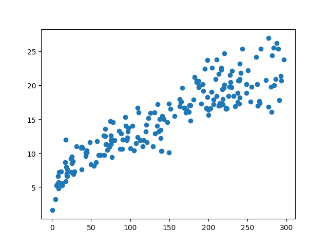
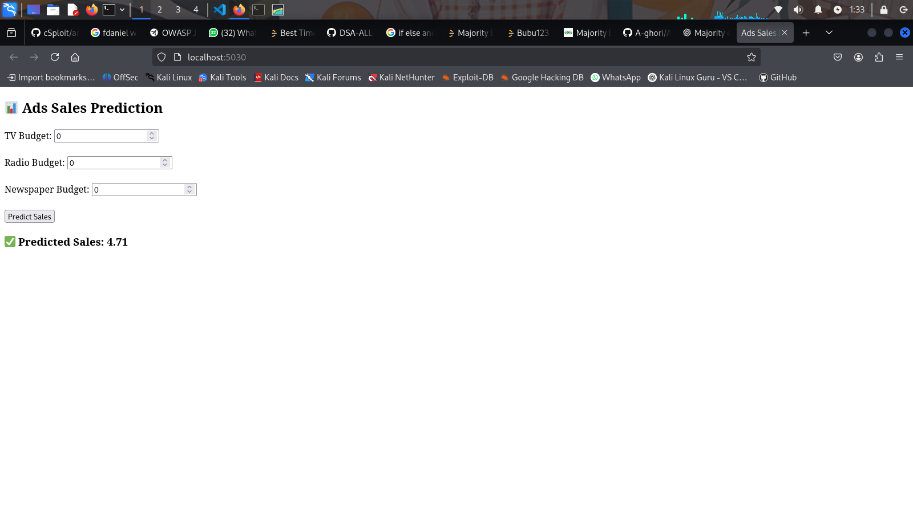
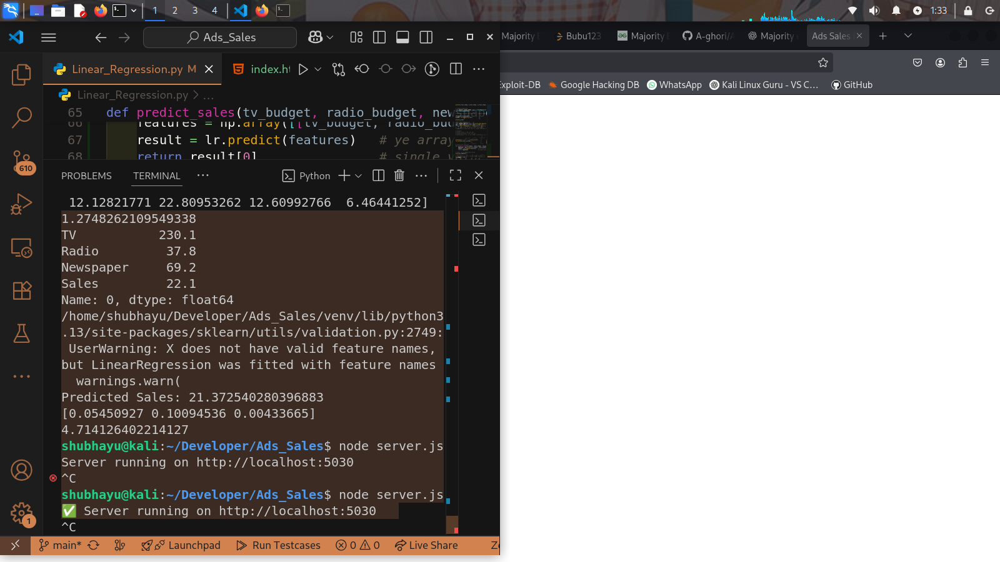
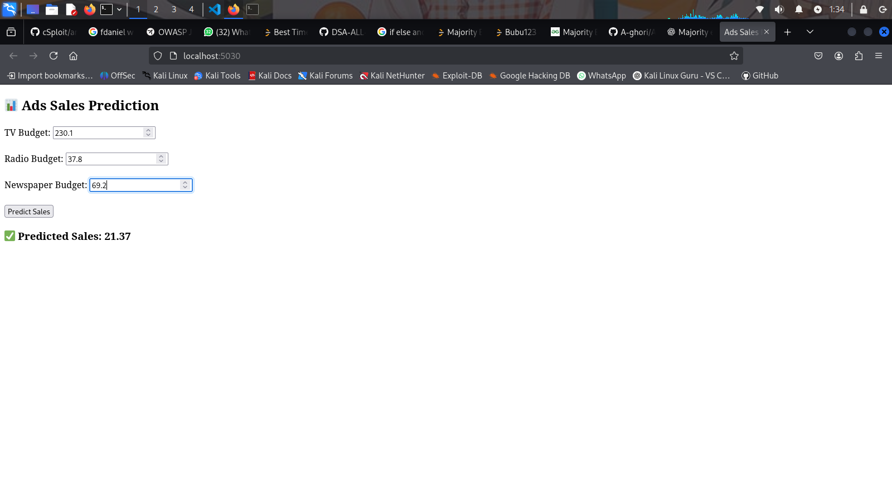

# Ads Sales Prediction Project

## Project Description
This project implements a linear regression model to predict sales based on advertising budgets for TV, Radio, and Newspaper. The model is built using Python and serves predictions through a web interface powered by an Express server.

## Project Structure
```
Ads_Sales
├── Advertising.csv
├── Linear_Regression.py
├── server.js
├── public
│   └── index.html
├── README.md
```

## File Descriptions

### 1. Advertising.csv
This file contains the dataset used for the linear regression model. It includes the following columns:
- **TV**: Budget allocated for TV advertising.
- **Radio**: Budget allocated for Radio advertising.
- **Newspaper**: Budget allocated for Newspaper advertising.
- **Sales**: Corresponding sales figures.

### 2. Linear_Regression.py
This Python script implements the linear regression model using the dataset from `Advertising.csv`. It performs the following tasks:
- **Imports necessary libraries**: 
  - `pandas` for data manipulation.
  - `numpy` for numerical operations.
  - `matplotlib` and `seaborn` for data visualization.
  - `scikit-learn` for building the linear regression model.
  
- **Loads the dataset** and displays the first few rows:
```python
df = pd.read_csv('Advertising.csv')
print(df.head())
```

- **Visualizes the relationship** between TV budget and Sales using a scatter plot:
```python
df3 = plt.scatter(df['TV'], y=df['Sales'])
plt.show()
```


- **Splits the dataset** into training and testing sets:
```python
X = df.iloc[:, :-1]   # All columns except the last one
y = df.iloc[:, -1]    # Only the last column
X_train, X_test, y_train, y_test = train_test_split(X, y, test_size=0.2, random_state=42)
```

- **Trains a linear regression model** using the training data:
```python
lr.fit(X_train, y_train)
```

- **Makes predictions** on the test data and evaluates the model using metrics like Mean Absolute Error (MAE) and R-squared score:
```python
y_pred = lr.predict(X_test)
acc = mean_absolute_error(y_test, y_pred)
print(acc)
```

- **Defines a prediction function** to estimate sales based on given budgets for TV, Radio, and Newspaper:
```python
def predict_sales(tv_budget, radio_budget, newspaper_budget):
    features = np.array([[tv_budget, radio_budget, newspaper_budget]])
    result = lr.predict(features)
    return result[0]
```

### 3. server.js
This JavaScript file sets up an Express server that serves the static HTML file and handles predictions. It includes:
- **Middleware** for parsing JSON requests and serving static files:
```javascript
app.use(bodyParser.json());
app.use(express.static(path.join(__dirname, "public")));
```

- **A prediction function** that calculates sales based on the linear regression coefficients and intercept:
```javascript
function predictSales(tv, radio, newspaper) {
  return intercept + coefficients[0] * tv + coefficients[1] * radio + coefficients[2] * newspaper;
}
```

- **An API route** that accepts POST requests to predict sales based on user-provided budgets:
```javascript
app.post("/predict", (req, res) => {
  const { tv, radio, newspaper } = req.body;
  const prediction = predictSales(tv, radio, newspaper);
  res.json({ predicted_sales: prediction });
});
```

### 4. public/index.html
This HTML file provides a user interface for inputting budgets for TV, Radio, and Newspaper. It includes:
- **A form** for users to enter their budgets.
- **JavaScript code** to handle form submission, send a POST request to the server, and display the predicted sales.

---

## Linear Regression Model Breakdown

### **Model Formula**
The linear regression model predicts sales based on the following formula:
\[
\text{Sales} = \beta_0 + \beta_1 \times \text{TV} + \beta_2 \times \text{Radio} + \beta_3 \times \text{Newspaper}
\]
Where:
- \( \beta_0 \) is the intercept.
- \( \beta_1, \beta_2, \beta_3 \) are the coefficients for TV, Radio, and Newspaper budgets, respectively.

### **Coefficients and Intercept**
- Coefficients: [0.05450927, 0.10094536, 0.00433665]
- Intercept: 4.714126402214127

---

## Evaluation Metrics & Formulas

### **Mean Absolute Error (MAE)**
Measures the average absolute difference between actual and predicted sales.
\[
MAE = \frac{1}{n} \sum_{i=1}^{n} |y_{true,i} - y_{pred,i}|
\]
Where:
- \( y_{true,i} \) is the actual sales value.
- \( y_{pred,i} \) is the predicted sales value.
- \( n \) is the number of samples.

### **R-squared Score (\( R^2 \))**
Indicates how well the model explains the variance in sales.
\[
R^2 = 1 - \frac{\sum_{i=1}^{n} (y_{true,i} - y_{pred,i})^2}{\sum_{i=1}^{n} (y_{true,i} - \bar{y}_{true})^2}
\]
Where:
- \( \bar{y}_{true} \) is the mean of actual sales values.

### **Prediction Function Formula**
Given budgets for TV, Radio, and Newspaper, the predicted sales are:
\[
\text{Predicted Sales} = 4.7141 + 0.0545 \times \text{TV} + 0.1009 \times \text{Radio} + 0.0043 \times \text{Newspaper}
\]

---

## Instructions for Running the Project
1. **Install Dependencies**:
   Make sure you have Python and Node.js installed. Install the required Python libraries:
   ```
   pip install pandas numpy matplotlib seaborn scikit-learn
   ```
   Install Express for the server:
   ```
   npm install express body-parser
   ```

2. **Run the Python Script**:
   Execute the `Linear_Regression.py` script to train the model:
   ```
   python Linear_Regression.py
   ```

3. **Start the Server**:
   Run the `server.js` file to start the Express server:
   ```
   node server.js
   ```

4. **Access the Web Interface**:
   Open your web browser and navigate to `http://localhost:5030` to access the prediction interface.

---

## Screenshots
- Web Interface: 
- Terminal Interface: 
- Prediction Interface: 

---

## Summary of Formulas Used

- **Linear Regression Model:**  
  \[
  \text{Sales} = \beta_0 + \beta_1 \times \text{TV} + \beta_2 \times \text{Radio} + \beta_3 \times \text{Newspaper}
  \]

- **Mean Absolute Error (MAE):**  
  \[
  MAE = \frac{1}{n} \sum_{i=1}^{n} |y_{true,i} - y_{pred,i}|
  \]

- **R-squared Score (\( R^2 \)):**  
  \[
  R^2 = 1 - \frac{\sum_{i=1}^{n} (y_{true,i} - y_{pred,i})^2}{\sum_{i=1}^{n} (y_{true,i} - \bar{y}_{true})^2}
  \]

- **Prediction Function:**  
  \[
  \text{Predicted Sales} = 4.7141 + 0.0545 \times \text{TV} + 0.1009 \times \text{Radio} + 0.0043 \times \text{Newspaper}
  \]

---

This README provides a comprehensive overview of the Ads Sales Prediction project, detailing each component, its functionality, and all relevant formulas.
